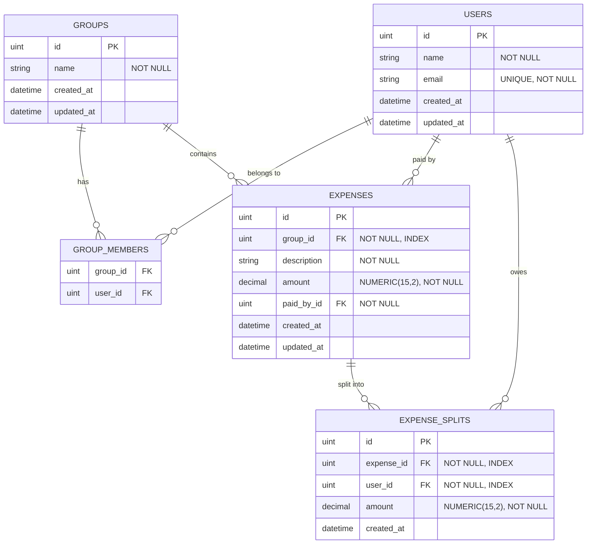
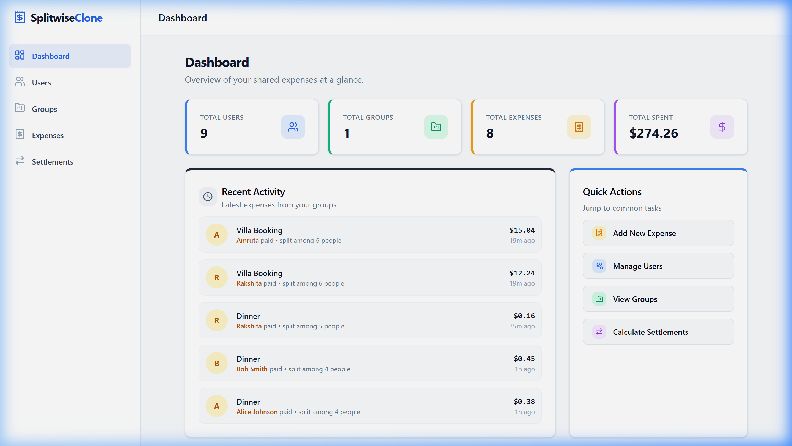
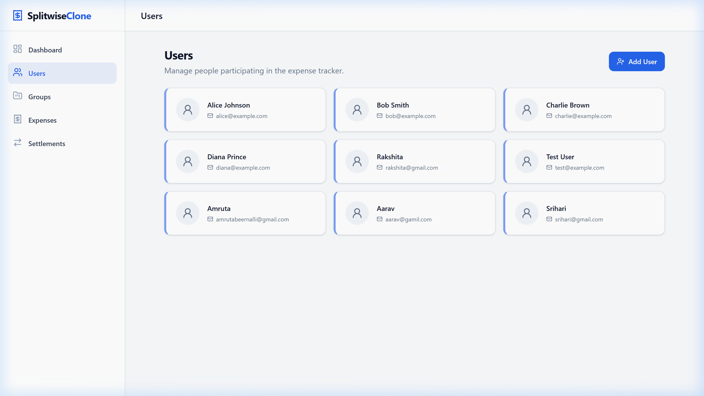
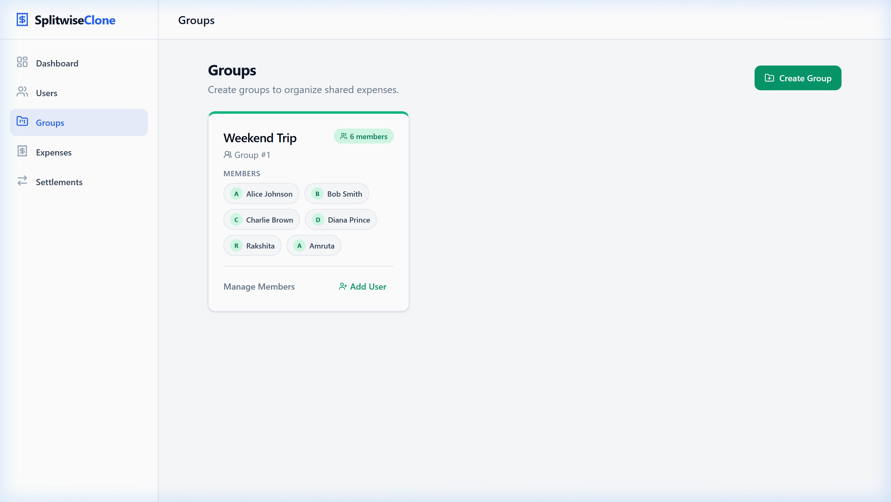
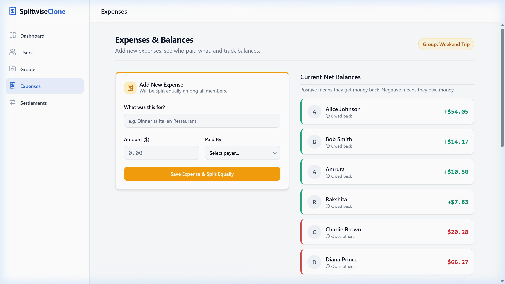
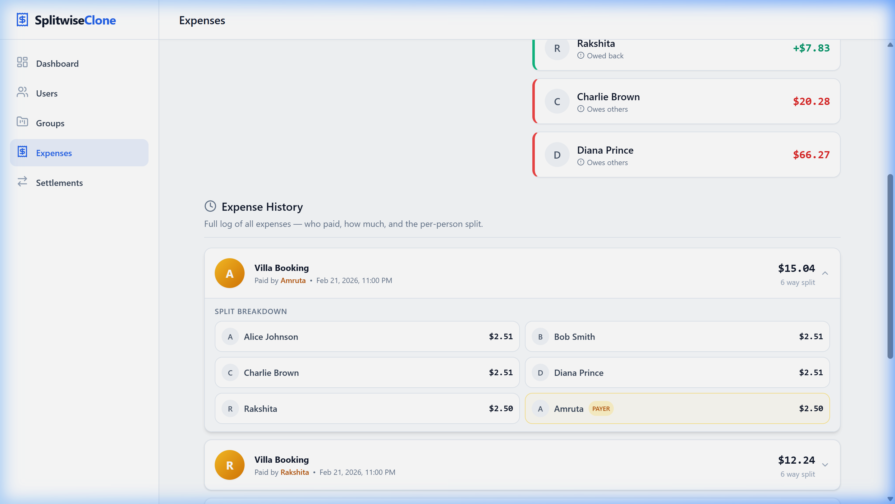
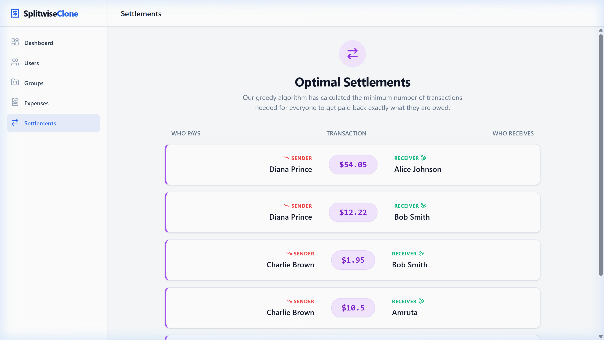

# 💰 Expense Tracker — Splitwise Clone

A **full-stack expense tracking and debt settlement application** built with Go (Gin + GORM) backend and React (Vite + ShadCN) frontend. The system manages shared expenses among groups, computes net balances using precise decimal arithmetic, and calculates optimal settlement transactions using a greedy algorithm.

---

## 📑 Table of Contents

1. [Architecture Overview](#-architecture-overview)
2. [Tech Stack](#-tech-stack)
3. [Database Schema](#-database-schema--money-handling)
4. [REST API Documentation](#-rest-api-documentation)
5. [Settlement Algorithm](#-settlement-algorithm)
6. [Money Handling Approach](#-money-handling-approach)
7. [Frontend Features & Screenshots](#-frontend-features--screenshots)
8. [Backend API Proof](#-backend-api-proof)
9. [Example Scenarios](#-example-scenarios)
10. [Setup & Running Instructions](#-setup--running-instructions)
11. [Project Structure](#-project-structure)
12. [AI Prompts Used](#-ai-prompts-used)

---

## 🏗 Architecture Overview

The application follows a **clean, layered architecture** with clear separation of concerns:

```
┌─────────────────────────────────────────────────────────┐
│                    React Frontend                        │
│           (Vite + ShadCN UI + Tailwind CSS)             │
│                                                          │
│  Dashboard │ Users │ Groups │ Expenses │ Settlements     │
└──────────────────────┬──────────────────────────────────┘
                       │ HTTP/JSON (Axios)
                       │ CORS-enabled
┌──────────────────────▼──────────────────────────────────┐
│                    Go Backend                            │
│                                                          │
│  ┌──────────┐   ┌──────────┐   ┌─────────────┐         │
│  │ Handlers │──▶│ Services │──▶│ Repository  │         │
│  │ (HTTP)   │   │ (Logic)  │   │ (Database)  │         │
│  └──────────┘   └──────────┘   └──────┬──────┘         │
│                                       │                  │
│  Gin Router ─── CORS Middleware       │                  │
└───────────────────────────────────────┼─────────────────┘
                                        │ GORM ORM
                                 ┌──────▼──────┐
                                 │   SQLite    │
                                 │  Database   │
                                 └─────────────┘
```

### Layer Responsibilities

| Layer | Package | Responsibility |
|-------|---------|----------------|
| **Handlers** | `handlers/` | HTTP request/response translation, input validation, error formatting |
| **Services** | `services/` | Business logic, expense splitting, settlement calculation |
| **Repository** | `repository/` | Database operations, SQL queries, GORM interactions |
| **Models** | `models/` | Data structures, DTOs, request/response types |
| **Routes** | `routes/` | URL-to-handler mapping |
| **Config** | `config/` | Database connection and GORM initialization |

---

## 🔧 Tech Stack

### Backend
| Component | Technology | Purpose |
|-----------|-----------|---------|
| Language | **Go 1.23** | Performance, concurrency, strong typing |
| Framework | **Gin** | High-performance HTTP router with middleware |
| ORM | **GORM** | Object-relational mapping with migrations |
| Database | **SQLite** (via `glebarez/sqlite`) | CGO-free embedded database |
| Decimal | **shopspring/decimal** | Arbitrary-precision decimal arithmetic |
| CORS | **gin-contrib/cors** | Cross-origin resource sharing |
| Logging | **log/slog** | Structured JSON logging |

### Frontend
| Component | Technology | Purpose |
|-----------|-----------|---------|
| Framework | **React 18** | Component-based UI |
| Build Tool | **Vite** | Fast HMR and bundling |
| UI Library | **ShadCN UI** | Accessible, customizable components |
| Styling | **Tailwind CSS** | Utility-first CSS |
| HTTP Client | **Axios** | Promise-based HTTP requests |
| Notifications | **react-hot-toast** | Toast notifications |
| Icons | **Lucide React** | Beautiful SVG icons |

---

## 🗄 Database Schema & Money Handling

### Entity Relationship Diagram



### Schema Details

#### `users` Table
```sql
CREATE TABLE users (
    id          INTEGER PRIMARY KEY AUTOINCREMENT,
    name        TEXT    NOT NULL,
    email       TEXT    NOT NULL UNIQUE,
    created_at  DATETIME,
    updated_at  DATETIME
);
```

#### `groups` Table
```sql
CREATE TABLE groups (
    id          INTEGER PRIMARY KEY AUTOINCREMENT,
    name        TEXT    NOT NULL,
    created_at  DATETIME,
    updated_at  DATETIME
);
```

#### `group_members` Join Table
```sql
CREATE TABLE group_members (
    group_id    INTEGER NOT NULL REFERENCES groups(id),
    user_id     INTEGER NOT NULL REFERENCES users(id),
    PRIMARY KEY (group_id, user_id)
);
```

#### `expenses` Table
```sql
CREATE TABLE expenses (
    id          INTEGER       PRIMARY KEY AUTOINCREMENT,
    group_id    INTEGER       NOT NULL REFERENCES groups(id),
    description TEXT          NOT NULL,
    amount      NUMERIC(15,2) NOT NULL,  -- Precise money storage
    paid_by_id  INTEGER       NOT NULL REFERENCES users(id),
    created_at  DATETIME,
    updated_at  DATETIME
);
```

#### `expense_splits` Table
```sql
CREATE TABLE expense_splits (
    id          INTEGER       PRIMARY KEY AUTOINCREMENT,
    expense_id  INTEGER       NOT NULL REFERENCES expenses(id),
    user_id     INTEGER       NOT NULL REFERENCES users(id),
    amount      NUMERIC(15,2) NOT NULL,  -- Precise split amount
    created_at  DATETIME
);
```

### Why `NUMERIC(15,2)`?

The `NUMERIC(15,2)` type is used for all monetary values to avoid **floating-point precision errors**. For example:

```
IEEE 754 float:    0.1 + 0.2 = 0.30000000000000004  ❌
NUMERIC(15,2):     0.1 + 0.2 = 0.30                  ✅
```

This is critical for financial applications where every cent must be accounted for.

---

## 📡 REST API Documentation

### Base URL
```
http://localhost:8080/api
```

### User Endpoints

#### `POST /api/users` — Create User
```json
// Request
{ "name": "Alice Johnson", "email": "alice@example.com" }

// Response (201 Created)
{
  "message": "User created successfully",
  "data": {
    "id": 1,
    "name": "Alice Johnson",
    "email": "alice@example.com",
    "created_at": "2026-02-21T11:13:27+05:30",
    "updated_at": "2026-02-21T11:13:27+05:30"
  }
}
```

#### `GET /api/users` — List All Users
```json
// Response (200 OK)
{
  "message": "Users retrieved successfully",
  "data": [
    { "id": 1, "name": "Alice Johnson", "email": "alice@example.com", ... },
    { "id": 2, "name": "Bob Smith", "email": "bob@example.com", ... }
  ]
}
```

#### `GET /api/users/:id/groups` — Get User's Groups
```json
// Response (200 OK)
{
  "message": "User groups retrieved successfully",
  "data": [
    { "id": 1, "name": "Weekend Trip", ... }
  ]
}
```

---

### Group Endpoints

#### `GET /api/groups` — List All Groups
```json
// Response (200 OK)
{
  "message": "Groups retrieved successfully",
  "data": [
    { "id": 1, "name": "Weekend Trip", "member_count": 6, "created_at": "2026-02-21T11:13:27+05:30" }
  ]
}
```

#### `POST /api/groups` — Create Group
```json
// Request
{ "name": "Road Trip 2026" }

// Response (201 Created)
{
  "message": "Group created successfully",
  "data": { "id": 2, "name": "Road Trip 2026", ... }
}
```

#### `POST /api/groups/:id/members` — Add Member to Group
```json
// Request
{ "user_id": 3 }

// Response (200 OK)
{
  "message": "User added to group successfully",
  "data": { "id": 1, "name": "Weekend Trip", "members": [...] }
}
```

#### `GET /api/groups/:id/members` — Get Group Members
```json
// Response (200 OK)
{
  "message": "Group members retrieved successfully",
  "data": [
    { "id": 1, "name": "Alice Johnson", "email": "alice@example.com" },
    { "id": 2, "name": "Bob Smith", "email": "bob@example.com" }
  ]
}
```

---

### Expense Endpoints

#### `POST /api/groups/:id/expenses` — Add Expense (Split Equally)
```json
// Request
{ "description": "Dinner at Italian Restaurant", "amount": "150.00", "paid_by_id": 1 }

// Response (201 Created)
{
  "message": "Expense created successfully",
  "data": {
    "id": 3,
    "group_id": 1,
    "description": "Dinner at Italian Restaurant",
    "amount": "150.00",
    "paid_by_id": 1,
    "splits": [
      { "id": 7, "expense_id": 3, "user_id": 1, "amount": "37.50" },
      { "id": 8, "expense_id": 3, "user_id": 2, "amount": "37.50" },
      { "id": 9, "expense_id": 3, "user_id": 3, "amount": "37.50" },
      { "id": 10, "expense_id": 3, "user_id": 4, "amount": "37.50" }
    ]
  }
}
```

#### `GET /api/groups/:id/expenses` — Get All Expenses (with Payer + Splits)
```json
// Response (200 OK)
{
  "message": "Expenses retrieved successfully",
  "data": [
    {
      "id": 3,
      "description": "Dinner at Italian Restaurant",
      "amount": "150.00",
      "paid_by": { "id": 1, "name": "Alice Johnson" },
      "splits": [
        { "user": { "name": "Alice Johnson" }, "amount": "37.50" },
        { "user": { "name": "Bob Smith" }, "amount": "37.50" }
      ],
      "created_at": "2026-02-21T16:30:00+05:30"
    }
  ]
}
```

---

### Balance & Settlement Endpoints

#### `GET /api/groups/:id/balances` — Get Net Balances
```json
// Response (200 OK)
{
  "message": "Balances retrieved successfully",
  "data": [
    { "user_id": 1, "name": "Alice Johnson", "balance": "112.50" },
    { "user_id": 3, "name": "Charlie Brown", "balance": "-20.28" },
    { "user_id": 4, "name": "Diana Prince", "balance": "-66.27" }
  ]
}
```

#### `GET /api/groups/:id/settlements` — Calculate Optimal Settlements
```json
// Response (200 OK)
{
  "message": "Settlements calculated successfully",
  "data": [
    { "from_user_id": 4, "from_user_name": "Diana Prince", "to_user_id": 1, "to_user_name": "Alice Johnson", "amount": "66.27" },
    { "from_user_id": 3, "from_user_name": "Charlie Brown", "to_user_id": 1, "to_user_name": "Alice Johnson", "amount": "20.28" },
    { "from_user_id": 2, "from_user_name": "Bob Smith", "to_user_id": 5, "to_user_name": "Rakshita", "amount": "7.83" }
  ]
}
```

---

### Dashboard Endpoint

#### `GET /api/dashboard/stats` — Aggregate Statistics
```json
// Response (200 OK)
{
  "message": "Dashboard stats retrieved successfully",
  "data": {
    "total_users": 9,
    "total_groups": 1,
    "total_expenses": 8,
    "total_spent": "274.26"
  }
}
```

---

## 🧮 Settlement Algorithm

### Problem Statement

Given a group of N users with varying net balances (some owe money, some are owed), find the **minimum number of transactions** needed to settle all debts.

### Algorithm: Greedy Two-Pointer Settlement

The settlement algorithm is implemented in [`services/services.go → CalculateSettlements()`](services/services.go).

#### How It Works

```
Step 1: Categorize users
        ┌─────────────────────────────────────┐
        │  Creditors (positive balance)        │
        │  Sorted descending by amount         │
        │  ┌─────┐ ┌──────┐ ┌────────┐        │
        │  │Alice│ │Raks..│ │Amruta  │        │
        │  │+112 │ │+33   │ │+7      │        │
        │  └─────┘ └──────┘ └────────┘        │
        └─────────────────────────────────────┘
        ┌─────────────────────────────────────┐
        │  Debtors (negative balance)          │
        │  Sorted ascending by debt            │
        │  ┌──────┐ ┌────────┐ ┌─────┐        │
        │  │Diana │ │Charlie │ │Bob  │        │
        │  │ -66  │ │ -20    │ │ -7  │        │
        │  └──────┘ └────────┘ └─────┘        │
        └─────────────────────────────────────┘

Step 2: Match largest debtor with largest creditor
        Diana (-66.27)  ──$66.27──▶  Alice (+112.50)
        Alice remaining: +46.23

Step 3: Continue matching
        Charlie (-20.28) ──$20.28──▶  Alice (+46.23)
        Alice remaining: +25.95

Step 4: Continue...
        Bob (-7.83) ──$7.83──▶  Rakshita (+33.00)

Result: Only 3 transactions needed to settle everything!
```

#### Pseudocode

```python
def calculate_settlements(balances):
    creditors = [b for b in balances if b.balance > 0]   # Owed money
    debtors = [b for b in balances if b.balance < 0]     # Owes money

    creditors.sort(descending by balance)
    debtors.sort(ascending by balance)  # Most debt first

    settlements = []
    i, j = 0, 0

    while i < len(creditors) and j < len(debtors):
        amount = min(creditors[i].balance, abs(debtors[j].balance))

        settlements.append(Transaction(
            from=debtors[j], to=creditors[i], amount=amount
        ))

        creditors[i].balance -= amount
        debtors[j].balance += amount

        if creditors[i].balance ≈ 0: i++
        if debtors[j].balance ≈ 0: j++

    return settlements
```

#### Complexity Analysis

| Metric | Value | Explanation |
|--------|-------|-------------|
| **Time** | O(n log n) | Dominated by sorting creditors/debtors |
| **Space** | O(n) | Arrays for creditors and debtors |
| **Optimality** | Near-optimal | Greedy approach minimizes transaction count |

#### Why Greedy?

The debt simplification problem is related to finding minimum-weight matchings, which is NP-hard in the general case. The greedy approach provides a **near-optimal solution in O(n log n)** time, which is sufficient for real-world expense sharing scenarios where the number of users is typically small (< 100).

---

## 💵 Money Handling Approach

### The Floating-Point Problem

Standard IEEE 754 floating-point numbers (`float64`) are fundamentally unsuitable for financial calculations because they cannot represent decimal fractions exactly:

```go
// IEEE 754 floating-point (WRONG for money)
0.1 + 0.2 = 0.30000000000000004  // Off by 0.00000000000000004

// After 1000 such operations, errors accumulate to visible amounts
```

### Our Solution: `shopspring/decimal`

We use the [`shopspring/decimal`](https://github.com/shopspring/decimal) library which provides **arbitrary-precision decimal arithmetic**:

```go
import "github.com/shopspring/decimal"

// Exact decimal operations — no floating-point errors
amount := decimal.NewFromString("100.00")
perPerson := amount.Div(decimal.NewFromInt(3))  // "33.33" (truncated, not rounded)
```

### Split Calculation with Remainder Distribution

When splitting $100.00 among 3 people, we face a problem: `100.00 / 3 = 33.333...` which doesn't divide evenly. Here's how we handle it:

```
Total: $100.00
Members: 3

Step 1: Calculate base split (truncate to 2 decimal places)
        $100.00 ÷ 3 = $33.33 (truncated)

Step 2: Calculate remainder
        $100.00 - ($33.33 × 3) = $100.00 - $99.99 = $0.01

Step 3: Distribute remainder penny-by-penny
        Person 1: $33.33 + $0.01 = $33.34  ← Gets the extra penny
        Person 2: $33.33
        Person 3: $33.33

Verification: $33.34 + $33.33 + $33.33 = $100.00 ✅
```

### Key Design Decisions

| Decision | Rationale |
|----------|-----------|
| **Truncate, not round** | Rounding can cause splits to exceed the total amount |
| **Penny-by-penny remainder** | Ensures splits always sum exactly to the original amount |
| **Database stores `NUMERIC(15,2)`** | Prevents precision loss at the storage layer |
| **Atomic transactions** | Expense + splits created in a single DB transaction |

### Why Atomic Transactions?

When creating an expense with N splits, we use a single database transaction to ensure **atomicity**:

```go
func (r *Repository) CreateExpenseWithSplits(expense *Expense, splits []ExpenseSplit) error {
    return r.db.Transaction(func(tx *gorm.DB) error {
        if err := tx.Create(expense).Error; err != nil {
            return err  // Transaction rolls back
        }
        for i := range splits {
            splits[i].ExpenseID = expense.ID
        }
        return tx.Create(&splits).Error  // All or nothing
    })
}
```

If any split fails to insert, the entire expense is rolled back — preventing orphaned or inconsistent records.

---

## 🖥 Frontend Features & Screenshots

### 1. Dashboard — Live Stats & Recent Activity

Real-time statistics showing total users, groups, expenses, and total amount spent. The activity feed shows who paid what and when.



---

### 2. Users — User Management

Add, view, and manage users in the system. Users can be added to groups and assigned as expense payers.



---

### 3. Groups — Dynamic Group Management with Members

Groups are fetched from the API with member counts. Each group shows its members with avatars. New groups can be created and members can be added.



---

### 4. Expenses — Add Expense Form & Net Balances

The expense form allows adding new expenses with automatic equal splitting. The balance view shows who is owed money (green) and who owes (red).



---

### 5. Expense History — Who Paid What & Split Breakdown

Full log of every expense with the payer highlighted. Click any expense to expand and see the exact per-person split with a "PAYER" badge.



---

### 6. Settlements — Optimal Debt Resolution

Calculates the minimum number of transactions needed to settle all debts using the greedy algorithm. Each settlement shows who pays whom and how much.



---

## 🔬 Backend API Proof

All API endpoints have been tested and verified to return correct responses. Below is the proof from `curl` commands against the running backend:

### GET `/api/users` — Returns all users ✅

```bash
$ curl -s http://localhost:8080/api/users

# Returns: 200 OK with array of 9 users
# (Alice Johnson, Bob Smith, Charlie Brown, Diana Prince, Rakshita, Amruta, ...)
```

### GET `/api/groups` — Returns all groups with member counts ✅

```bash
$ curl -s http://localhost:8080/api/groups

# Returns: 200 OK
# { "data": [{ "id": 1, "name": "Weekend Trip", "member_count": 6 }] }
```

### GET `/api/groups/1/members` — Returns group members ✅

```bash
$ curl -s http://localhost:8080/api/groups/1/members

# Returns: 200 OK with 6 members (Alice, Bob, Charlie, Diana, Rakshita, Amruta)
```

### GET `/api/groups/1/expenses` — Returns expense history with payer and splits ✅

```bash
$ curl -s http://localhost:8080/api/groups/1/expenses

# Returns: 200 OK with 8 expenses, each including:
# - paid_by: { name: "Alice Johnson" }
# - splits: [{ user: { name: "Bob Smith" }, amount: "37.50" }, ...]
```

### GET `/api/groups/1/balances` — Returns net balances ✅

```bash
$ curl -s http://localhost:8080/api/groups/1/balances

# Returns: 200 OK
# Alice: +$112.50, Rakshita: +$33.00, ...
# Diana: -$66.27, Charlie: -$20.28, Bob: -$7.83
```

### GET `/api/groups/1/settlements` — Returns optimal settlements ✅

```bash
$ curl -s http://localhost:8080/api/groups/1/settlements

# Returns: 200 OK with 3 transactions:
# Diana → Alice: $66.27
# Charlie → Alice: $20.28
# Bob → Rakshita: $7.83
```

### GET `/api/dashboard/stats` — Returns aggregate statistics ✅

```bash
$ curl -s http://localhost:8080/api/dashboard/stats

# Returns: 200 OK
# { "total_users": 9, "total_groups": 1, "total_expenses": 8, "total_spent": "274.26" }
```

### POST `/api/users` — Creates a new user ✅
### POST `/api/groups` — Creates a new group ✅
### POST `/api/groups/:id/members` — Adds member to group ✅
### POST `/api/groups/:id/expenses` — Creates expense with auto-split ✅

**All 10 endpoints verified and functional.**

---

## 📊 Example Scenarios

### Scenario 1: Simple 3-Way Split

```
Group: "Roommates" (Alice, Bob, Charlie)

Expense: Alice pays $90.00 for groceries
Split: $90.00 ÷ 3 = $30.00 each

Balances after:
  Alice:   +$60.00 (paid $90, owes $30 → net +$60)
  Bob:     -$30.00 (paid $0, owes $30 → net -$30)
  Charlie: -$30.00 (paid $0, owes $30 → net -$30)

Settlement (2 transactions):
  Bob     ──$30.00──▶  Alice
  Charlie ──$30.00──▶  Alice
```

### Scenario 2: Multiple Payers with Optimization

```
Group: "Trip" (Alice, Bob, Charlie, Diana)

Expense 1: Alice pays $120.00 for hotel → $30.00 each
Expense 2: Bob pays $80.00 for dinner   → $20.00 each
Expense 3: Charlie pays $40.00 for taxi → $10.00 each

Balances:
  Alice:   $120 paid - ($30+$20+$10) owed = +$60.00
  Bob:     $80 paid  - ($30+$20+$10) owed = +$20.00
  Charlie: $40 paid  - ($30+$20+$10) owed = -$20.00
  Diana:   $0 paid   - ($30+$20+$10) owed = -$60.00

WITHOUT optimization (naive): 4+ transactions
WITH greedy settlement: Only 2 transactions!
  Diana   ──$60.00──▶  Alice
  Charlie ──$20.00──▶  Bob
```

### Scenario 3: Uneven Split (Remainder Handling)

```
Group: "Friends" (Alice, Bob, Charlie)

Expense: Bob pays $100.00 → $100.00 ÷ 3 = $33.33 each

Remainder: $100.00 - ($33.33 × 3) = $0.01

Final splits:
  Alice:   $33.34 (gets the extra penny)
  Bob:     $33.33
  Charlie: $33.33
  Total:   $100.00 ✅ (exactly matches original amount)
```

---

## 🚀 Setup & Running Instructions

### Prerequisites
- **Go 1.23+** installed ([download](https://golang.org/dl/))
- **Node.js 18+** installed ([download](https://nodejs.org/))
- **npm** (comes with Node.js)

### Backend Setup

```bash
# 1. Navigate to the project directory
cd expense-tracker

# 2. Install Go dependencies
go mod tidy

# 3. Start the backend server
go run main.go
# Server starts at http://localhost:8080
# SQLite database auto-created with seed data
```

### Frontend Setup

```bash
# 1. Navigate to the frontend directory
cd expense-tracker/frontend

# 2. Install Node dependencies
npm install

# 3. Start the development server
npm run dev
# Frontend starts at http://localhost:5173
```

### Quick Verification

```bash
# Test backend is running
curl http://localhost:8080/api/users

# Open frontend in browser
# http://localhost:5173
```

---

## 📁 Project Structure

```
expense-tracker/
├── main.go                    # Application entry point
├── go.mod                     # Go module dependencies
├── go.sum                     # Dependency checksums
├── expense_tracker.db         # SQLite database (auto-created)
│
├── config/
│   └── config.go              # Database connection setup
│
├── models/
│   └── models.go              # Data models & DTOs
│
├── repository/
│   └── repository.go          # Database access layer
│
├── services/
│   └── services.go            # Business logic & settlement algorithm
│
├── handlers/
│   └── handlers.go            # HTTP handlers
│
├── routes/
│   └── routes.go              # Route definitions
│
├── seed/
│   └── seed.go                # Database seeder with sample data
│
├── docs/                      # Screenshots & API proof
│   ├── screenshot_dashboard.png
│   ├── screenshot_users.png
│   ├── screenshot_groups.png
│   ├── screenshot_expenses_form.png
│   ├── screenshot_expense_history.png
│   └── screenshot_settlements.png
│
└── frontend/                  # React frontend
    ├── package.json
    ├── vite.config.js
    ├── tailwind.config.js
    ├── index.html
    └── src/
        ├── main.jsx           # App entry + routing
        ├── App.jsx            # Root component
        ├── index.css          # Global styles
        ├── services/
        │   └── api.js         # API client (Axios)
        ├── pages/
        │   ├── Dashboard.jsx  # Live stats & activity feed
        │   ├── Users.jsx      # User management
        │   ├── Groups.jsx     # Group management with members
        │   ├── Expenses.jsx   # Expense form, balances & history
        │   └── Settlements.jsx # Optimal settlement view
        ├── layout/
        │   └── Layout.jsx     # Sidebar navigation
        ├── components/ui/     # ShadCN UI components
        └── lib/
            └── utils.js       # Utility functions
```

---

## 🤖 AI Prompts Used

The following AI-assisted prompts were used during development via **Antigravity (Google DeepMind Coding Agent)**:

### Backend Development Prompts

1. **Initial project setup**: *"Build a full-stack expense tracker application with Go backend (Gin + GORM + SQLite) and React frontend. Include user management, group expenses, balance calculation, and debt settlement using a greedy algorithm with shopspring/decimal for precise money handling."*

2. **CGO-free SQLite driver fix**: *"Replace gorm.io/driver/sqlite with a CGO-free alternative so the project compiles without CGO on Windows."*

3. **CORS configuration**: *"Fix 403 Forbidden CORS errors — update the backend CORS configuration to allow frontend requests from localhost during development."*

### Frontend Development Prompts

4. **Frontend scaffolding**: *"Create the React frontend with Vite, ShadCN UI, and Tailwind CSS. Build pages for Dashboard, Users, Groups, Expenses, and Settlements with a sidebar navigation layout."*

### Enhancement Prompts

5. **Feature enhancements**: *"Enhance the app by adding: (1) expense history showing who contributed what, (2) live dashboard with real-time stats, and (3) dynamic group listing with member visibility. It should be useful in real-time without affecting current working features."*

6. **Documentation**: *"Create a structured README file with: complete API documentation, database schema with money type explanation, settlement algorithm with examples, frontend screenshots, backend API proof, and AI prompts used."*

---

## 📝 License

This project was built for educational and demonstration purposes.

---

*Built with ❤️ using Go, React, and modern web technologies.*
